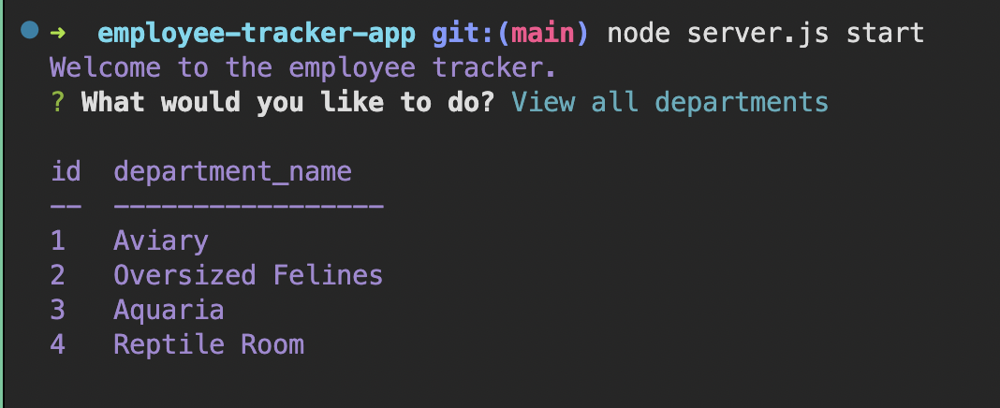

# Employee Tracker App

## Table of Contents

---

1. [Description](#description)
1. [Usage Recommendations](#usage-recommendations)
1. [Demo](#demo)

## Description

---

This is a command line app designed to help business owners view and manage employee data for departments, roles, and employees to more easily organize and plan

The user can add information to and delete information from the SQL database. Existing data for departments, roles, or employees can be viewed as a formatted table in the command line.

## Usage Recommendations

---

To use this app to manage your own organization, clone the repository code to your local device. From the command line, pass `node server.js start`

## Demo

---

To see the employee tracker in action, check out this
[demonstration video](https://external.ink?to=/watch.screencastify.com/v/IIiLumMhl7kYC7Hjg83M).
